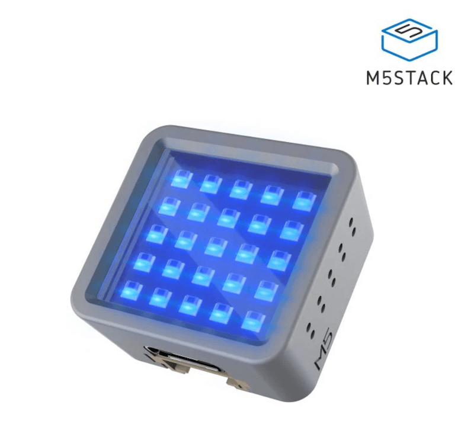
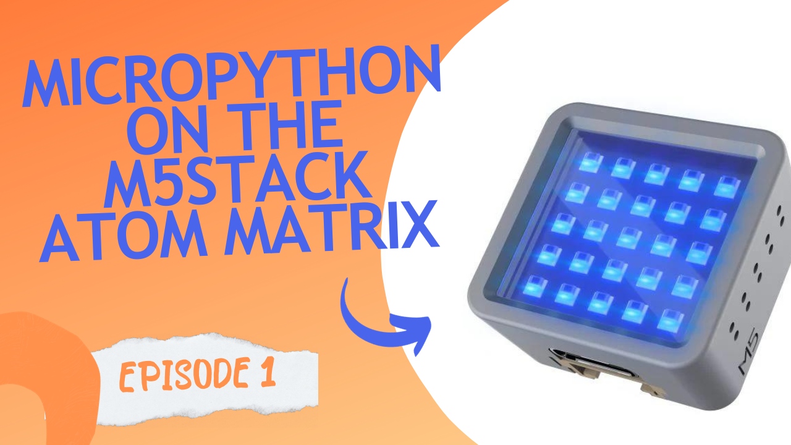
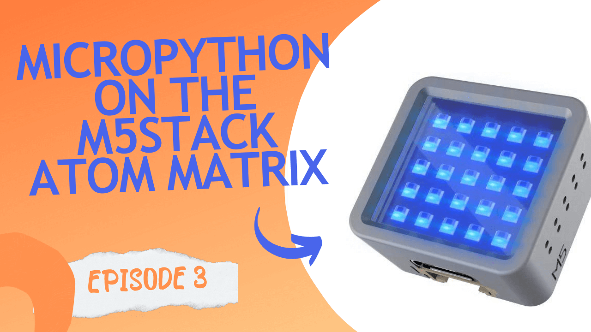

# M5Stack Atom Matrix MicroPython Live Streams

## Introduction

This repository contains the code that accompanies my live streaming series in which I played around with installing and running MicroPython code on the M5Stack Atom Matrix device.

## Videos

Check out the videos on YouTube (click the images to view -- come on GitHub we need YouTube embeds in README files!)...

In episode 1 I installed MicroPython and wrote code to use the LEDs and button.  Then I demonstrated how to connect to WiFi and read and display the current Cheerlights color using an MQTT broker.

In Episode 2 I showed a small pull request that I'd made to improve MicroPython's utility module for the M5Stack Atom Matrix and we played with the accelerometer.

Episode 3 is scheduled for Friday 12th January 2024 at 11am UTC.  I'll be trying to connect different sensors to the device using the Grove connector that's built into it.

Subscribe on [YouTube](https://www.youtube.com/@simonprickett) or [follow me on Twitter](https://twitter.com/simon_prickett) to be notified when streams are scheduled.  My live streams also go out on LinkedIn and [Twitch](https://twitch.tv/simonprickett) if you prefer.

## The M5Stack Atom Matrix Device

The M5Stack Atom Matrix is a small (24mm square by 14mm tall) IoT device that packs a lot into a small space for a decent price.

It features:

* ESP32 chip with onboard WiFi.
* 4Mb flash memory.
* 5x5 RGB LED matrix - the LEDs are the "neopixel" type that can be individually addressed and set to RGB colors.
* A programmable button (press on the LED matrix!).
* Inertial sensor / gyroscope.
* Grove and USB C connectors.

Check out the full specification sheet on the M5Stack documentation site [here](https://docs.m5stack.com/en/core/ATOM%20Matrix).

There are other devices in the M5Stack Atom range, but this project specifically works with the Matrix model.

These devices cost around US$15 and you can buy them from the usual places:

* Direct from [M5Stack](https://shop.m5stack.com/products/atom-matrix-esp32-development-kit).
* [Pimoroni](https://shop.pimoroni.com/products/atom-matrix-esp32-development-kit?variant=31880178532435) (UK based, worldwide shipping).
* [Adafruit](https://www.adafruit.com/product/4497) (US based, worlwide shipping).
* Others...

## Installing MicroPython on the Device

The device doesn't come with MicroPython pre-installed (it's set up to work with C and the [Arduino IDE](https://www.arduino.cc/en/software)).  Installing MicroPython is a relatively simple process: use the `esptool` Python script to erase the flash, download the right MicroPython image for it, and use the same `esptool` to copy the image to the device.

Instructions are provided on the [device's page on the MicroPython site](https://micropython.org/download/M5STACK_ATOM/).

Once you've installed MicroPython you can start a REPL using [mpremote](https://docs.micropython.org/en/latest/reference/mpremote.html), [Thonny](https://thonny.org/), or your usual preferred MicroPython development toolchain.  I chose Thonny for the live streams.

When I installed MicroPython, I found that the `esptool` command to copy the runtime onto the device gave an error.  Omitting the baud rate option `--baud 460800` fixed it for me.

## Support for this Device in MicroPython

The device-specific MicroPython build for the Atom series comes with a utility module that makes working with the LEDs and button easier, abstracting the hardware details away a bit.  The module is part of the MicroPython project, so is pre-installed in the runtime for the device.  [Check out the source for it on GitHub](https://github.com/micropython/micropython/blob/master/ports/esp32/boards/M5STACK_ATOM/modules/atom.py).

I used this in the first stream to work with the LED matrix and the button.  Check out [`main.py`](first-livestream/main.py) from the first stream for example code.

During the first stream, I realized that the `Matrix` class could benefit from an extra function to set the color of an LED given its x, y position on the matrix.  The existing class takes a LED position number with the first one being 0.  So, to set the first LED on the 2nd row you have to know it's number 5 (0-4 being the first row).

I added my own `set_pixel_color_x_y` in my code and talked about doing a pull request to get something similar added to the MicroPython build for this device.  After the stream I created a pull request to add `set_pixel_color_x_y` and `get_pixel_color_x_y` functions. Let's see if it makes it into a future MicroPython release!  Follow its progress on GitHub [here](https://github.com/micropython/micropython/pull/13350).

## Code from the First Live Stream

In the first live stream I demonstrated how to control the LEDs (all at once and individually) using the `Matrix` class in the `atom` module.

We then moved on to writing a utility function that took x, y co-ordinates to identify each LED in the matrix before seeing how to react to button presses with a callback function.

I then demonstrated how to connect to a wifi network and use MicroPython's [MQTT client](https://pypi.org/project/micropython-umqtt.simple/) to receive messages from the [Cheerlights](https://cheerlights.com/) MQTT broker.  Cheerlights is a global network of connected lights that can be set to show different colours.

MQTT is a lightweight protocol that uses the publish/subscribe model.  Read more about it and watch the video on [kevsrobots.com](https://www.kevsrobots.com/resources/how_it_works/mqtt.html) if you'd like to learn more.

The current Cheerlights color is published to a few different MQTT topics on their broker.  To display the current color on the Atom Matrix we need to translate the information on a topic to R, G, B values and pass those into the `set_pixels_color` function in the `Matrix` class.

I chose to do this with a set of `if` / `elif` statements so that I could specify my own R, G, B values for each color that Cheerlights can be set to.  This allowed me to pick representations that worked well with the camera and lighting I had for the live stream - avoiding the situation where the LEDs shine so brightly that the camera blurs them or becomes saturated with their color.

The code from the first live stream can be found in this repo in the [`first-livestream`](first-livestream/) folder.

## Find this Useful?

If you found this useful and would like to see me make more of this sort of thing, please consider [buying me a coffee](https://ko-fi.com/simonprickett).  All proceeds will be spent on purchasing more devices / sensors etc for future projects which will all be open sourced.  Thanks!
